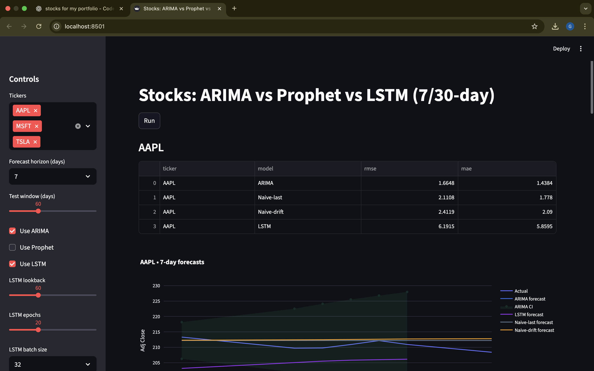
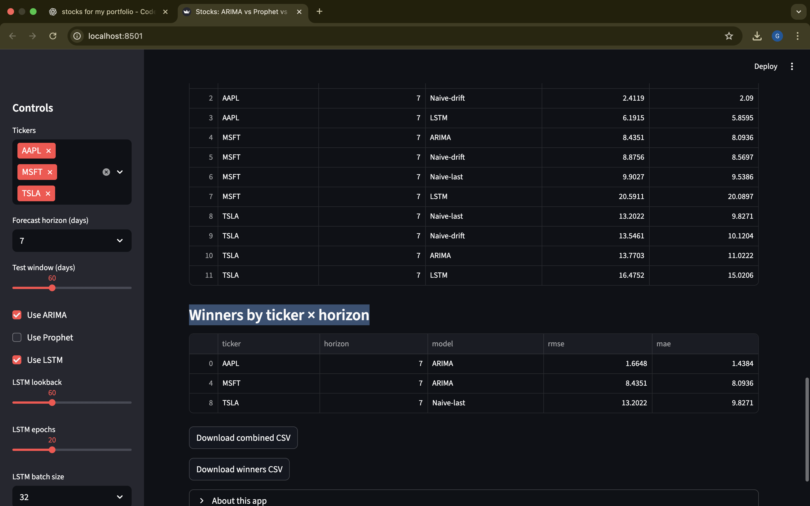

# Stock Forecast Lab — ARIMA & Prophet vs LSTM (Streamlit)

Compare short-horizon stock forecasts (7 & 30 days) using **ARIMA**, **Prophet**, and a lightweight **LSTM** against simple naïve baselines. 
The app fetches daily prices from Yahoo Finance, plots all model forecasts on one chart, and scores models on a recent holdout window with **RMSE/MAE**.

> **Why?** Quick, practical benchmarking of classic time‑series models vs a tiny neural net on real market data.

---

## ✨ Features

- 🔎 **Tickers**: choose multiple large‑caps (AAPL, MSFT, TSLA, …)  
- ⏳ **Horizons**: 7‑ and 30‑day forecasts  
- 📈 **Overlay**: history + all model forecasts in one Plotly chart  
- 📊 **Scores**: RMSE & MAE on the last *N* trading days (default 60)  
- 🧪 **Baselines**: Naive‑last and Naive‑drift for sanity checks  
- 💾 **Downloads**: combined scores + per‑ticker winners as CSV  
- 🧰 **Graceful deps**: ARIMA/Prophet/LSTM auto‑disable if not installed

---

## 🧱 How it works

1. **Load**: Daily adjusted close via `yfinance` (last 5 years by default).  
2. **Split**: Train / Test (last *N* days = test).  
3. **Forecast**:  
   - **ARIMA** (`pmdarima` or `statsmodels`) → next `H` business days  
   - **Prophet** → directly on the *exact* test dates  
   - **LSTM** (small TF model) → next `H` business days  
   - **Naive** (last / drift) on exact test dates  
4. **Align**: Coerce outputs to **test dates** and drop NaNs.  
5. **Score**: RMSE/MAE on the overlapping dates.  
6. **Visualize**: Multi‑model overlay + tables + CSV export.

---

## 🚀 Quick start

> **Use Python 3.11.** (Avoid 3.12/3.13 to skip compiling heavy wheels like pandas/scipy from source.)

### macOS / Linux
### Fastest way to run (bypasses PATH/conda)
From the project folder:
```bash
./.venv311/bin/python -m streamlit run streamlit_app.py

```bash
python3.11 -m venv .venv
source .venv/bin/activate

python -m pip install --upgrade pip
pip install -r requirements_full.txt

python -m streamlit run streamlit_app.py
```

### Windows (PowerShell)

#### Fastest way to run (uses the venv’s Python directly)
```powershell
# From the project root
.\.venv311\Scripts\python.exe -m streamlit run streamlit_app.py
First-time setup (create venv, install deps, run)
# From the project root
py -3.11 -m venv .venv
.\.venv\Scripts\Activate.ps1   # (PowerShell)
# If you get a policy error, see the note below.

python -m pip install --upgrade pip
pip install -r requirements_full.txt

python -m streamlit run streamlit_app.py
Notes
   If your venv is named .venv311, replace .venv accordingly.
   If activation fails with an execution policy error:
```powershell
   Set-ExecutionPolicy -Scope CurrentUser -ExecutionPolicy RemoteSigned
   Then try .\.venv\Scripts\Activate.ps1 again.

---

## 📦 Requirements

### `requirements_full.txt` (recommended)

```txt
streamlit>=1.50
yfinance>=0.2.66
pandas<2.2
numpy==1.26.4
plotly>=6.3.0
scikit-learn>=1.7.2
pmdarima==2.0.4
prophet==1.1.5
cmdstanpy<1.2
tensorflow-cpu==2.15.0
statsmodels>=0.14.5
```

> Prophet may download **CmdStan** on first run (a few minutes and ~1–2 GB). You can start with ARIMA + LSTM and enable Prophet later.

### Minimal (no Prophet / no TF)

If you just want ARIMA + baselines:

```txt
streamlit>=1.50
yfinance>=0.2.66
pandas<2.2
numpy==1.26.4
plotly>=6.3.0
scikit-learn>=1.7.2
pmdarima==2.0.4
statsmodels>=0.14.5
```

---

## 🧭 Using the app

1. Choose **Tickers**, **Horizon** (7 or 30), and **Test window** (default 60).  
2. Toggle models (ARIMA/Prophet/LSTM). Unavailable libs show as disabled.  
3. Click **Run**.  
4. Review per‑ticker **scores table** and the **multi‑model plot**.  
5. Scroll down for **Combined Results**, **Winners**, and **Download** buttons.

---

## 🎨 Optional polish

Add a theme by creating `.streamlit/config.toml`:

```toml
[theme]
base = "light"
primaryColor = "#2D6CDF"
secondaryBackgroundColor = "#F6F8FB"
textColor = "#0F172A"
```

You can also set a Plotly white template + consistent model colors in `streamlit_app.py`.

---

## 📁 Project structure

```
.
├─ streamlit_app.py
├─ requirements_full.txt
└─ .streamlit/
   └─ config.toml   # optional theme
```

---

## 🧪 Model notes

- **ARIMA**: often strong for short horizons; uses `auto_arima` where available.  
- **Prophet**: smooth trends + uncertainty bands; forecasts on *exact* test dates.  
- **LSTM**: tiny, single‑series; scaled with `MinMaxScaler`, inverse‑transformed for metrics.  
- **Baselines**: always include for context; sometimes they beat fancy models.

---

## 🛠️ Troubleshooting

| Symptom / Error | Likely cause | Fix |
|---|---|---|
| `No module named streamlit` / `command not found: streamlit` | Virtualenv not active or wrong interpreter | Activate venv, then `pip install -r requirements_full.txt`. Verify with `which python` and `pip show streamlit` (site‑packages should be inside `.venv`). Use `python -m streamlit run ...` to be sure it runs from the venv. |
| `metadata-generation-failed` building pandas/scipy | Using Python 3.12/3.13 (no prebuilt wheels) | Use **Python 3.11**, recreate venv, reinstall requirements. |
| Prophet slow / hangs on first run | CmdStan toolchain download/compile | Let it finish once; or start with ARIMA/LSTM and enable Prophet later. |
| `index is not a valid DatetimeIndex or PeriodIndex` | Non‑datetime index passed into a model | Always run the provided `_normalize_ds_y` before modeling; the app already enforces this. |
| `Input contains NaN` during scoring | Forecasts didn’t align to test dates or missing points | This app aligns forecasts to test dates and drops NaNs. If you added custom code, ensure you **inner‑join on dates** and `dropna(['yhat','y'])`. |
| Charts not showing | Browser caching / app not rerun | Click **Rerun** in Streamlit and refresh the browser. Check console for exceptions. |
| ARIMA/Prophet/LSTM options greyed out | Library not installed in current env | Check the sidebar hints; install missing libs or toggle off the model. |

---

## 🔧 Configuration

- **Horizon**: 7 or 30 days (UI control).  
- **Test window**: default 60 trading days (UI control).  
- **LSTM**: lookback/epochs/batch adjustable (sidebar).  
- **Data period**: loader pulls last 5y by default; adjust in `load_series(...)` if needed.

---

## 📌 Limitations & Next steps

- Single split (no walk‑forward CV).  
- Univariate LSTM (no exogenous vars).  
- No hyper‑parameter search.  
- Doesn’t handle stock‑specific events (splits/earnings) beyond `auto_adjust=True` prices.

**Ideas to extend:** walk‑forward CV with re‑training, add ETS/Theta/XGBoost baselines, 
confidence intervals for LSTM via MC‑dropout, feature engineering (returns, vol, macro indicators).

---

## 🤝 Credits

Built by **GBEMILEKE MICAH**  
Libraries: Streamlit, yfinance, pmdarima, Prophet, TensorFlow, scikit‑learn, Plotly

---

## 📜 License

Released under the **MIT License** — see `LICENSE` for details.
##Screenshots




## Screenshots
<p align="center">
  
  
</p>

